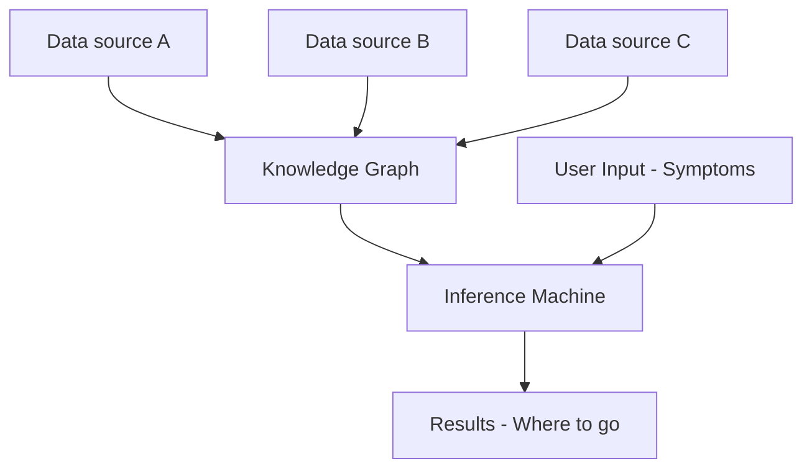

# TODO

1. Build Knowledge Graph

a. Webscraper for data sources

DynaMed has lots of data!

https://www.nhsinform.scot/illnesses-and-conditions

https://www.nhsinform.scot/symptoms-and-self-help/a-to-z

Malacards

Prevalence & Incidence Metrics

https://www.uwmedicine.org/conditions-symptoms

NER:
https://cs230.stanford.edu/blog/namedentity/

2. Build Simulated environemnt - DONE
3. NLP to get symptom entities
4. Query Knowledge graph
