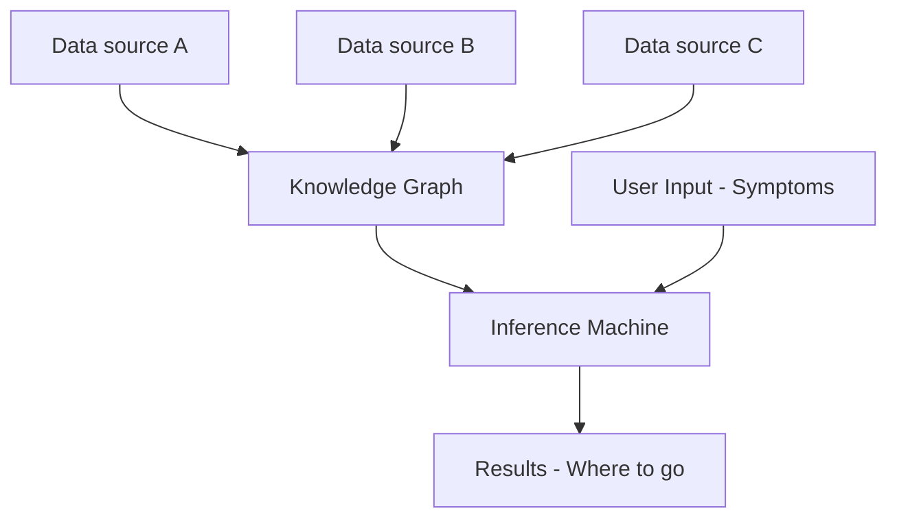

```mermaid
  graph TD;
  A[Data source A]-->K[Knowledge Graph];
  B[Data source B]-->K;
  C[Data source C]-->K;
  K-->I[Inference Machine];
  U[User Input - Symptoms]-->I;
  I-->R[Results - Where to go]
```