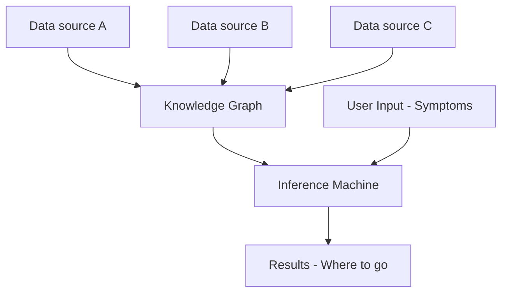

# Notes for Dr. Bayat
Hello! Thank you for helping me with this project! Here are a few notes to help this repo make some more sense:

### Code
1. dev.ipynb is a playground to test ideas, etc.
2. files with 'scraper' in the name are programs written to scrape data sources for information.
3. the zip file has all the data from the last time the webscraper fetched
4. most of the code lies on google colab, as i wanted to easily use GPUs, it will be migrated here soon.

### Thesis
1. If .pages format is not accessible, please let me know
2. Color coding: Red -> Will be rewritten, Green -> ideas (will be written)

